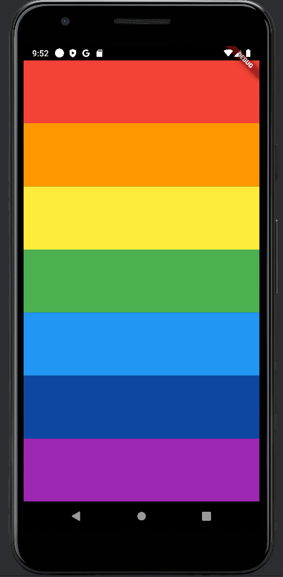

# Xylophone App

This project is a simple xylophone application developed as part of Angela Yu's Flutter course on Udemy. The app allows users to play musical notes by tapping on colored bars, each representing a different note.

## Description

The Xylophone app is a fun and interactive way to learn about Flutter development and sound integration in mobile applications. This project demonstrates the basics of creating a simple user interface, handling user interactions, and playing audio files in a Flutter app.

## Features

- Interactive UI with colorful xylophone bars
- Plays different musical notes when bars are tapped
- Simple and intuitive design
- Uses Flutter and Dart for cross-platform development

